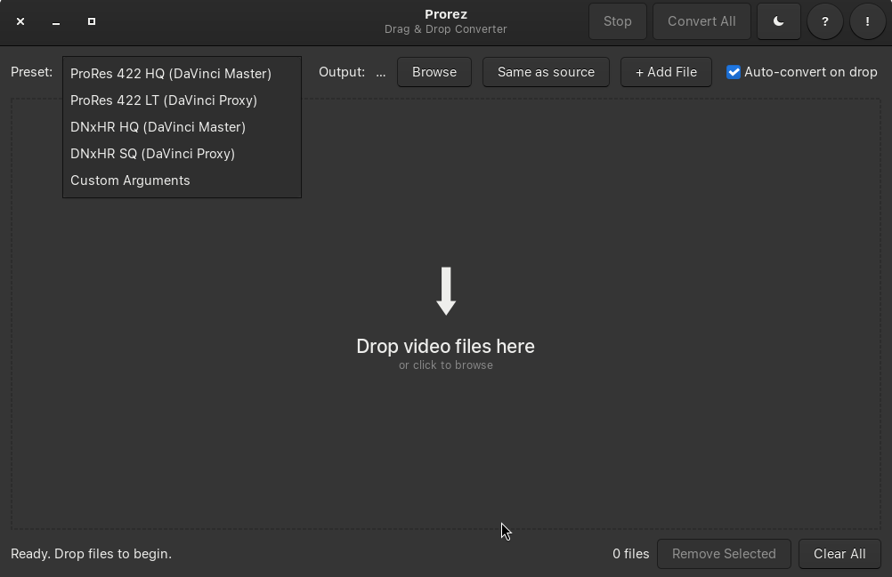

# Prorez

Drag & drop video converter for DaVinci Resolve on Linux.

Converts video files to DaVinci Resolve-compatible formats (ProRes, DNxHR) with GPU-accelerated encoding and PCM audio.

## Features

- Drag & drop interface — just drop files and convert
- **ProRes 422 HQ/LT** — high quality mastering and proxy presets
- **DNxHR HQ/SQ** — industry standard Avid codecs
- **Custom Arguments** — full FFmpeg control
- GPU auto-detection (NVIDIA NVENC, VAAPI, QSV, AMF)
- Light / dark theme
- Output to same folder or custom directory
- File queue with progress tracking

## Requirements

### System

- Linux (X11)
- Python 3.8+
- GTK 3
- FFmpeg (with `ffprobe`)

```bash
# Ubuntu/Debian
sudo apt install python3-gi gir1.2-gtk-3.0 ffmpeg

# Fedora
sudo dnf install python3-gobject gtk3 ffmpeg

# Arch
sudo pacman -S python-gobject gtk3 ffmpeg
```

### Optional GPU Support

- **NVIDIA**: nvidia drivers + ffmpeg with nvenc
- **Intel**: intel-media-va-driver
- **AMD**: mesa-va-drivers

## Install

```bash
git clone https://github.com/dezuhan/prorez.git
cd prorez
python3 prorez.py
```

## Usage

```bash
python3 prorez.py
```

1. Drag video files into the window (or click **+ Add File**)
2. Select a preset matching your workflow
3. Click **Convert All**

Output files are saved as `prorez_convert_[original_name].[ext]` in the source folder by default.

## Presets

| Preset | Codec | Container | Use Case |
|--------|-------|-----------|----------|
| ProRes 422 HQ | Apple ProRes | MOV | Mastering / Color Grading |
| ProRes 422 LT | Apple ProRes | MOV | Proxy Editing |
| DNxHR HQ | Avid DNxHR | MOV | Professional Mastering |
| DNxHR SQ | Avid DNxHR | MOV | Proxy Editing |
| Custom Arguments | User-defined | — | Full FFmpeg control |

## Roadmap

- [ ] **RPM package** — `.rpm` for Fedora/RHEL (via COPR)

## Contributing

Pull requests are welcome. For major changes, open an issue first to discuss what you'd like to change.

1. Fork the repo
2. Create a feature branch (`git checkout -b feature/amazing-feature`)
3. Commit your changes (`git commit -m 'Add amazing feature'`)
4. Push to the branch (`git push origin feature/amazing-feature`)
5. Open a pull request

## Credits

- Built with [DeepSeek V4](https://deepseek.com) (vibe coding)
- Instagram: [@dezuhan](https://instagram.com/dezuhan)
- LinkedIn: [in/dzuhan](https://linkedin.com/in/dzuhan)
- GitHub: [@dezuhan](https://github.com/dezuhan)

## License

[GNU GPLv2](LICENSE)
